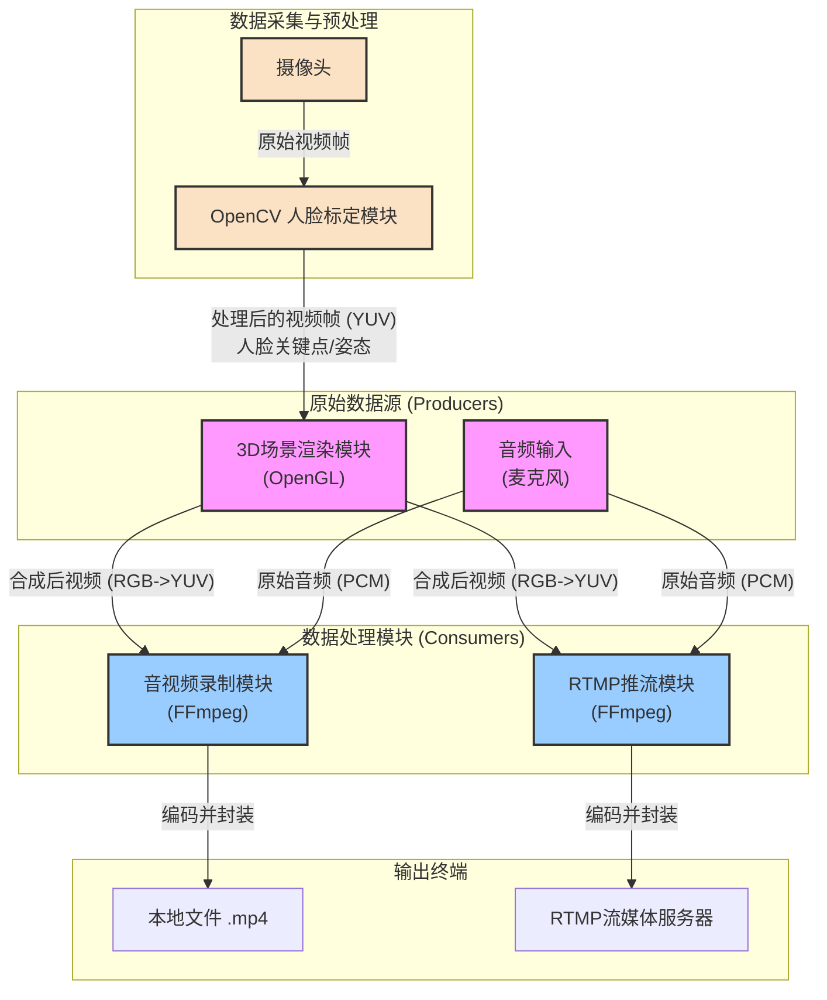
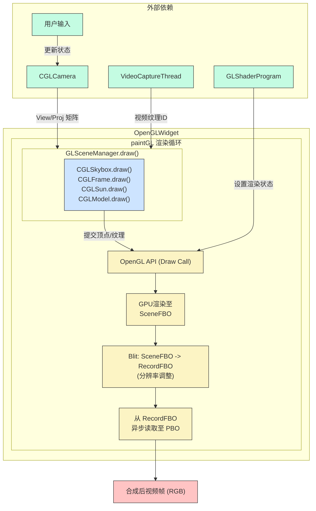
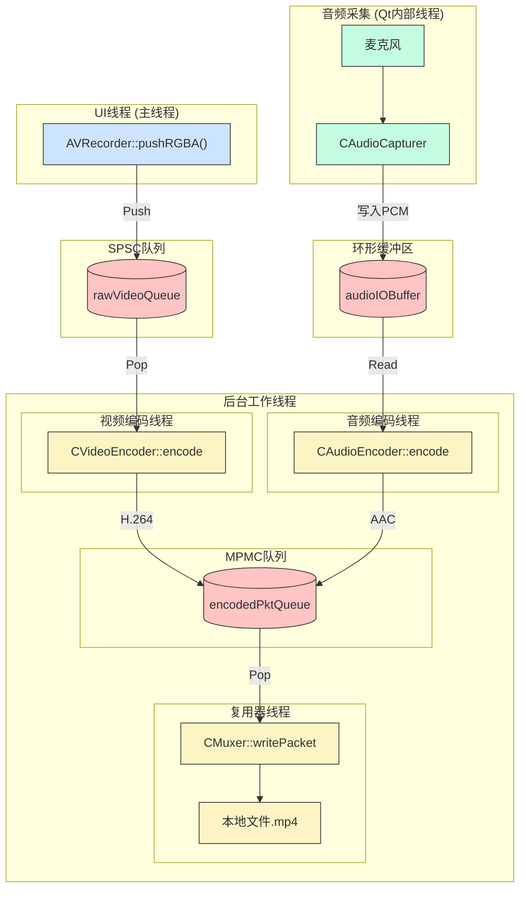
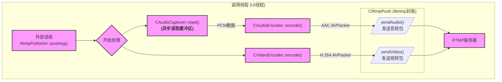
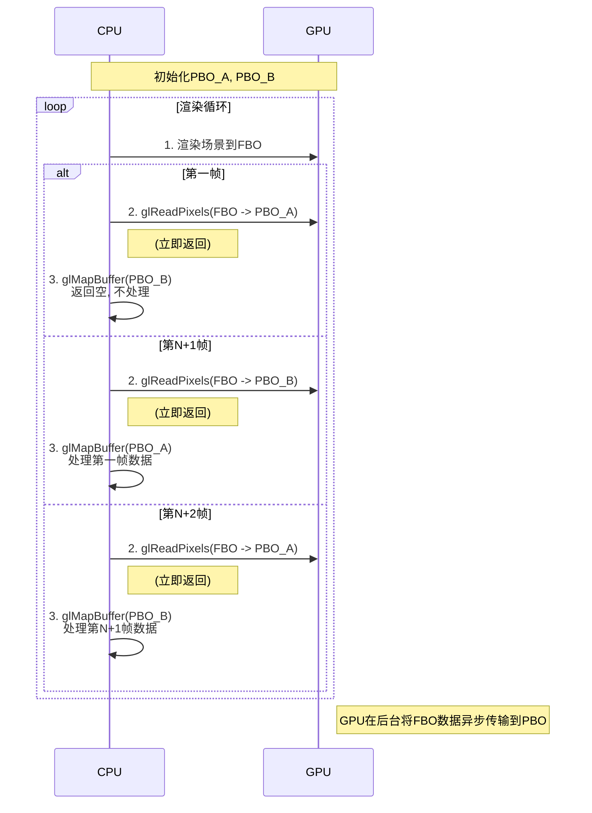

# LMEngine

## 一、框架分析

该项目整体分为三个部分：3D场景渲染模块，音视频录制模块，rtmp推流模块

其整体数据流向和模块关系如下图所示：



功能介绍：

1. 通过opencv对摄像头数据进行人脸标定，获取摄像头捕捉帧以及人脸坐标，对捕捉帧进行离屏渲染，获取texid
2. 3d场景渲染模块由：天空盒，渲染texid的幕布，obj文件加载器，跟随人脸坐标移动的3d模型，可自由移动的摄像机，冯氏光照模型，FBO分辨率转换适配录制要求 组成
3. 音视频录制模块实现：无锁队列，自己封装的复用器和音视频编码器
4. rtmp推流模块实现：nalu解析，rtmp头配置，flv的tag包配置 这三个功能。

流程说明

1.  **数据采集与预处理**：
    *   流程始于**摄像头**，它负责捕捉实时的视频画面。
    *   **OpenCV人脸标定模块** 对摄像头捕捉到的原始视频帧进行分析，计算出人脸的关键点位置和姿态信息。

2.  **数据生产**：
    *   **3D场景渲染模块**接收来自OpenCV模块的关键点数据，并以此为依据，将3D模型跟随人脸移动，最终生成合成后的视频流（RGB格式）。
    *   **音频输入**通过麦克风等设备并行采集原始音频数据（PCM格式）。

3.  **数据消费（并行处理）**：合成后的音视频流可以被一个或多个消费者模块订阅和处理。
    *   **路径1：音视频录制**：**音视频录制模块** 消费音视频流，利用FFmpeg进行编码（如H.264+AAC），并将其封装复用成MP4格式，最终保存为本地文件。
    *   **路径2：RTMP推流**：**RTMP推流模块** 同样消费音视频流，也利用FFmpeg进行编码，但将其封装为适应网络传输的FLV格式，然后通过RTMP协议推送到流媒体服务器。

## 二、模块组成分析

### 2.1 3D场景渲染模块

流程图：



流程说明

1. **外部依赖与输入**:
   *   `CGLCamera` 根据 `用户输入` 计算 **视图/投影矩阵**。
   *   `GLShaderProgram` 预先编译，定义了渲染所需的着色器逻辑。
   *   `VideoCaptureThread` 提供实时的 **视频纹理ID**。

2. **`paintGL` 核心渲染流程**:
   *   **场景绘制**: `GLSceneManager.draw()` 被调用，它从外部获取矩阵和纹理ID。
   *   **对象绘制**: `GLSceneManager` 依次调用其管理的四个子对象 (`CGLSkybox`, `CGLFrame`, `CGLSun`, `CGLModel`) 的 `draw` 方法。
   *   **提交API**: 每个子对象通过调用 `glDrawArrays` 或 `glDrawElements` 等 **OpenGL API** 函数来提交自己的绘制指令。
   *   **GPU渲染**: GPU根据当前绑定的`GLShaderProgram`和提交的顶点数据，执行渲染管线，并将结果输出到 **SceneFBO**。
   *   **分辨率转换**: 调用 `glBlitFramebuffer` 函数，将 `SceneFBO` 的内容传输到 **RecordFBO**。这个过程可以同时进行分辨率的缩放，从而使屏幕渲染分辨率与最终录制分辨率分离。
   *   **数据回读**: 通过 **PBO** (像素缓冲对象) 从 **RecordFBO** 中异步地将图像数据回读到CPU内存。

3. **输出**:
   *   PBO将数据从GPU传输至CPU后，生成一份 **合成后的视频帧（RGB）**，交付给后续模块。

4. 注意：

   显然我们可以发现，由于后续H.264编码器要求输入的视频帧格式为YUV420P，所以我们会在cpu中把RGB格式的视频帧转换成YUV420P，这会造成性能瓶颈，所以我们可以在GPU中做，具体请参考：[使用 OpenGL 实现 RGB 到 YUV 的图像格式转换-腾讯云开发者社区-腾讯云](https://cloud.tencent.com/developer/article/1828544)

   大致思路是：

   1. 创建一个`convertFBO_`，输入纹理使用`recordTexID_`，输出纹理命名为`convertTexID_`
   2. 在片段着色器中采样`recordTexID_`的rgb值，将其转换为YUV格式，并将结果写入当前片段的rgb分量中
   3. 通过`glReadPixels()`读取`convertFBO_`中的渲染结果（可以用双PBO优化），此时得到的数据应该是YUV420PACKED，或许还需要转换为YUV420P

### 2.2 音视频录制模块



流程说明

`AVRecorder` 的数据流转由多个独立模块和线程安全容器协同完成：

1.  **一级数据缓冲**:
    *   **视频**: **UI线程**通过`AVRecorder::pushRGBA()`将原始视频帧推入`SPSC队列 (rawVideoQueue)`。
    *   **音频**: **音频采集线程**将PCM数据写入`环形缓冲区 (audioIOBuffer)`。这两个容器作为一级缓冲，独立于其他所有模块。
2.  **后台工作与二级缓冲**:
    *   **编码**: “视频编码线程”和“音频编码线程”分别从一级缓冲中获取数据，编码为`AVPacket`。
    *   **缓冲**: 编码后的两种`AVPacket`都被推送到位于“后台工作线程”模块内部的`MPMC队列 (encodedPktQueue)`中，作为二级缓冲。
    *   **消费**: “复用器线程”从`MPMC队列`中拉取已编码的`AVPacket`。
    *   **输出**: `CMuxer`模块负责对音视频包按时间戳进行交错排序，然后写入MP4文件。

### 2.3 RTMP推流模块



`RtmpPublisher`的所有核心操作都在其`pushing()`方法被调用的线程（通常是UI线程）中同步完成，其流程如下：

1.  **数据获取**:
    *   当外部调用`pushing(rgbData)`时，函数开始执行。
    *   **音频**: 首先调用`CAudioCapturer::read()`。此步骤虽然是同步调用，但其数据源是`CAudioCapturer`内部由独立线程异步填充的**音频缓冲区**。
    *   **视频**: 直接使用方法传入的`rgbData`视频帧。

2.  **同步编码**:
    *   从缓冲区读取的PCM数据和传入的RGB视频数据，被分别立即送入`CAudioEncoder`和`CVideoEncoder`实例。
    *   编码器在当前线程直接执行计算，将原始数据转换为AAC和H.264格式的`AVPacket`。

3.  **数据输出 (I/O)**:
    *   编码后生成的`AVPacket`不经过任何队列，直接被传递给`CRtmpPush`组件。
    *   `CRtmpPush`是`librtmp`库的C++封装，它将`AVPacket`打包成RTMP协议规定的`RTMPPacket`格式。
    *   最终，通过`sendAudio()`和`sendVideo()`接口，数据包通过网络Socket被发送到目标RTMP服务器。整个过程为阻塞式I/O。

该模块的设计以牺牲一定的并发性能和UI响应性为代价，换取了控制流程的简单与直接。

## 三、重难点分析

### FFmpeg编解码过程中的内存管理

##### 场景一：解码循环

```c++
// 1. 初始化阶段: 分配“容器”
AVPacket *pkt = av_packet_alloc();
AVFrame *frame = av_frame_alloc();
// ... 错误检查 ...

// ... 打开文件和解码器 ...

// 2. 主处理循环
while (av_read_frame(format_ctx, pkt) == 0) {
    if (avcodec_send_packet(codec_ctx, pkt) < 0) { /* ... */ }

    // (A) AVPacket 内存管理:
    // 必须调用unref清空pkt，以便在下一次av_read_frame中复用。
    // 这会释放pkt对数据缓冲区的引用。如果解码器内部ref了该pkt，
    // 缓冲区不会被销毁；否则，它会被释放。
    av_packet_unref(pkt);

    while (avcodec_receive_frame(codec_ctx, frame) == 0) {
        // (B) AVFrame 内存管理:
        // 此处不需要调用av_frame_unref(frame)。
        // avcodec_receive_frame API保证在填充frame前会先调用unref。
        // 它自动处理了frame的复用和旧数据缓冲区的释放。
        
        // ... 使用 frame (渲染、分析等) ...
    }
}

// 3. 清理阶段: 销毁“容器”
av_packet_free(&pkt);
av_frame_free(&frame);
// ... 关闭解码器和文件 ...
```

**解码时如何防止内存泄漏**:

- **AVPacket**: 关键在于循环中**每次使用后都调用 av_packet_unref(pkt)**。这确保了av_read_frame在每次迭代中分配的数据缓冲区，其引用计数最终能被正确减少。
- **AVFrame**: 关键在于**信任avcodec_receive_frame**，它已经为你处理了unref。
- **结构体本身**: 循环结束后，**必须调用 av_packet_free() 和 av_frame_free()** 来释放最初_alloc的结构体内存。

##### 场景二：编码循环

```c++
// 1. 初始化阶段: 分配“容器”
AVPacket *pkt = av_packet_alloc();
AVFrame *frame = av_frame_alloc();
// ... 错误检查 ...

// ... 初始化编码器 ...

// 为frame设置固定属性并分配一次初始缓冲区
frame->format = codec_ctx->pix_fmt;
frame->width  = codec_ctx->width;
frame->height = codec_ctx->height;
if (av_frame_get_buffer(frame, 0) < 0) { /* 错误处理 */ }

// 2. 主处理循环
for (int i = 0; i < num_frames_to_encode; ++i) {
    // (A) AVFrame 内存管理:
    // 在写入新数据前，确保缓冲区是可写的。
    // 如果编码器仍在使用上一个frame的数据(ref_count > 1)，此时说明上一个frame可能是B帧
    // 此函数会自动分配新缓冲区，避免数据竞争。
    if (av_frame_make_writable(frame) < 0) { break; }

    // 现在可以安全地复写frame的数据区
    fill_yuv_data_into_frame_buffers(frame);
    frame->pts = i;

    if (avcodec_send_frame(codec_ctx, frame) < 0) { /* ... */ }

    while (avcodec_receive_packet(codec_ctx, pkt) == 0) {
        // (B) AVPacket 内存管理:
        // 与解码时一样，处理完pkt后必须unref，以备复用。
        av_packet_unref(pkt);
    }
}
// ... 冲刷编码器 ...

// 3. 清理阶段: 销毁“容器”
av_packet_free(&pkt);
av_frame_free(&frame);
// ... 关闭编码器和文件 ...
```

**编码时如何防止内存泄漏**:

- **AVFrame**: 关键在于**发送前调用 av_frame_make_writable(frame)**。这个函数是防止数据竞争和在必要时（而不是每次都）重新分配缓冲区的“智能”方式。如果你不使用它，而选择每次都unref+get_buffer，虽然安全但效率较低。如果你直接复写而不做任何处理，则会产生bug。
- **AVPacket**: 与解码时一样，**循环中每次使用后都调用 av_packet_unref(pkt)**。
- **结构体本身**: 循环结束后，**必须调用 av_packet_free() 和 av_frame_free()**。

### H.264码流解析

Annex B 格式码流解析

```c++
/*
 * 核心思路：通过搜索起始码来定位并分离每个 NALU。
 * 
 * 关键实现步骤：
 */

// 1. 定义起始码常量
const uint8_t start_code_3[] = {0x00, 0x00, 0x01};
const uint8_t start_code_4[] = {0x00, 0x00, 0x00, 0x01};

// 2. 实现一个函数来查找起始码
//    该函数从给定位置开始，在数据流中搜索 3字节或4字节的起始码。
//    返回起始码的起始位置迭代器。
std::vector<uint8_t>::const_iterator find_start_code(
    std::vector<uint8_t>::const_iterator begin,
    std::vector<uint8_t>::const_iterator end) 
{
    const uint8_t startCode3[] = { 0x00, 0x00, 0x01 };
    const uint8_t startCode4[] = { 0x00, 0x00, 0x00, 0x01 };

    auto it = std::search(begin, end, std::begin(startCode4), std::end(startCode4));
    if (it != end) {
        return it; // 返回起始码的开始位置
    }

    it = std::search(begin, end, std::begin(startCode3), std::end(startCode3));
    if (it != end) {
        return it; // 返回起始码的开始位置
    }

    return end;
}

// 3. 主解析循环
void parse_annexb_stream(const std::vector<uint8_t>& stream_data) {
    auto it_curr = stream_data.cbegin();
    auto it_end = stream_data.cend();

    while (it_curr < it_end) {
        // a. 查找当前 NALU 的起始位置
        auto it_nal_begin = find_start_code(it_curr, it_end);
        if (it_nal_begin == it_end) {
            break; // 未找到更多起始码，解析结束
        }

        // b. 确定起始码长度 (3或4字节)
        size_t start_code_len = (it_nal_begin + 3 < it_end && *(it_nal_begin + 3) == 0x01) ? 4 : 3;
        auto it_data_begin = it_nal_begin + start_code_len;

        // c. 查找下一个 NALU 的起始位置，即当前 NALU 的结束位置
        auto it_nal_end = find_start_code(it_data_begin, it_end);

        // d. 提取 NALU 数据 (不含起始码)
        std::vector<uint8_t> nal_unit_data(it_data_begin, it_nal_end);

        // e. 解析 NALU Header
        if (!nal_unit_data.empty()) {
            uint8_t nal_unit_type = nal_unit_data & 0x1F;
            
            switch (nal_unit_type) {
                case 7: // SPS
                    // parse_sps(nal_unit_data);
                    break;
                case 8: // PPS
                    // parse_pps(nal_unit_data);
                    break;
                // ... 其他类型处理
            }
        }
        
        // f. 更新当前位置，准备下一次搜索
        it_curr = it_nal_end;
    }
}
```

- **注意**: 在解析 SPS 和 PPS 的 RBSP 之前，需要先处理**防竞争字节**。即遍历 `nal_unit_data`，当遇到 `0x00 0x00 0x03` 序列时，将 `0x03` 移除。

### RTMP中的ID

| 特性         | **块流 ID (CSID)**                | **消息流 ID (Stream ID)**   | **消息类型 ID (Type ID)** |
| :----------- | :-------------------------------- | :-------------------------- | :------------------------ |
| **层面**     | 协议底层 (物理通道)               | 应用上层 (逻辑通道)         | 消息内容 (数据类型)       |
| **标识对象** | **块 (Chunk)**                    | **消息流 (Message Stream)** | **单个消息 (Message)**    |
| **核心作用** | 块的多路复用， 维持头部压缩上下文 | 关联一组有业务逻辑的消息    | 定义消息负载的解析方式    |

三者协作关系示例：

1.  **连接:**
    -   客户端发送 `connect` 命令消息。
    -   此时：`Stream ID = 0` (连接级命令), `Type ID = 20` (AMF0命令), `CSID = 2` (协议控制通道)。

2.  **创建流:**
    -   客户端发送 `createStream` 命令消息。
    -   此时：`Stream ID = 0` (仍是连接级命令), `Type ID = 20`, `CSID = 2`。
    -   服务器响应 `_result`，告知客户端成功创建了一个流，并分配了 `Stream ID = 1`。

3.  **发布与推流:**
    -   客户端发送 `publish` 命令消息。
    -   此时：`Stream ID = 1` (操作新建的流), `Type ID = 20`, `CSID` 通常为 `3` 或其他用于信令的通道。
    -   随后，客户端开始推送音视频数据：
        -   **发送视频消息:** `Stream ID = 1`, **`Type ID = 9`**, `CSID` 通常为 `4` (视频专用通道)。
        -   **发送音频消息:** `Stream ID = 1`, **`Type ID = 8`**, `CSID` 通常为 `5` (音频专用通道)。

### 无锁/低锁队列实现

#### 接口设计

无锁队列实现了单生产者-单消费者模型，低锁队列实现了多生产者-多消费者模型，内部数据结构使用链表实现

初始化时，头节点和尾节点指向同一个没有数据的空节点，此时`size_`为0，且`head_ == tail_`

当链表中有数据时，尾节点始终指向一个没有数据的空节点

不同的生产者之间和不同的消费者之间均使用对应的`head_mtx_`和`tail_mtx_`保证线程安全（无锁队列不做该设计）

生产者和消费者之间使用原子变量保证线程安全

##### `push`函数

1. 在插入数据前，应当判断队列是否已满，同时构造好【新的尾节点】和【待插入的数据】
2. 插入数据时，直接给尾节点的data成员赋值，同时更新尾节点为上一步构造的【新的尾节点】

##### `pop`函数

1. 弹出队列中的头节点（使用`pop_head()`）
2. 如果为空，则返回空，如果有值，则返回对应数据的智能指针

##### `pop_head`函数

1. 取队列头节点，并判断是否为空
2. 如果为空，则返回`nullptr`，否则更新`head_`，并返回弹出节点。

#### 优化

##### 内存模型优化

1. 生产者线程中，`tail_`的发布需要与【消费者线程中的`tail_`的获取】建立先行关系，使生产者对`tail_`的修改对消费者可见。
2. 消费者线程中，`size_`的发布需要与【生产者线程中的`size_`的获取】建立先行关系，使消费者对`size_`的修改对生产者可见。

如何理解以上两点呢？

对于第一点，我们需要关注的是：pop线程需要`tail_`来判断队列是否为空

对于第二点，我们需要关注的是：push线程需要`size_`来判断队列是否还能继续push数据

##### 异常安全保证

使用`shared_ptr`保证异常安全

### 无锁缓冲区实现

设计和无锁队列很像，关键差别在于：

1. 内部数据结构使用`vector<char>`实现
2. 写入/读取数据时可能因为回绕而分两次

### 多线程离屏渲染

#### OpenGL中的多线程同步机制

##### OpenGL的执行流

要想了解OpenGL同步操作，必须对OpenGL执行流有一定了解，OpenGL执行流特点可以用3句话概括：

- 异步执行

  OpenGL执行过程分为2个阶段：指令发射(issue)和指令执行(execution)。OpenGL 客户端维护了一个指令队列(command queue)，程序运行，先把指令从客户端发送到服务中的指令队列，然后GPU乱序执行队列中的指令，直至队列为空。

- 乱序执行

  OpenGL是乱序执行的，但它不是OpenGL的特性，而是现代CPU/GPU的特性。乱序执行(out-of-order execution)，指在不影响执行结果的大前提下，多核CPU/GPU不按程序规定的顺序执行指令的技术。

- 隐式同步

  虽然OpenGL的执行是异步、乱序的，但是为了简化编程难度，OpenGL设计规范(OpenGL specification)要求，要让用户在使用OpenGL API的时候，觉得代码是同步、顺序执行的。要求前面的代码对数据的修改，对后面的代码可见，这就是隐式同步技术。OpenGL中的API，比如`glTexSubImage2D()`, `glReadPixels()`, `glBufferSubData()` 等数据读写函数都采用了隐式同步技术。

具体demo代码，见：

[HHH-CHN17/LearnOpenGL-initOffScreenEnv()](https://github.com/HHH-CHN17/LearnOpenGL/blob/main/10_mutli_thread_offscreen_render/LearnOpenGL/LearnOpenGL/MainWidget.cpp#L87)

[HHH-CHN17/LearnOpenGL-run()](https://github.com/HHH-CHN17/LearnOpenGL/blob/main/10_mutli_thread_offscreen_render/LearnOpenGL/LearnOpenGL/CRenderThread.cpp#L36)

### 双PBO异步读取FBO

在本项目中，由OpenGL渲染的最终画面（存储在FBO中）需要被高效地回读到CPU内存，以供`AVRecorder`或`RtmpPublisher`进行视频编码。若使用传统的`glReadPixels`直接读取，CPU会被强制等待GPU完成渲染和数据传输，导致渲染管线阻塞，帧率严重下降，是典型的性能瓶颈。


为解决此问题，采用**双PBO**构建异步读取流水线的方案。PBO允许CPU发起一个“读取像素”的请求后立即返回，而由DMA控制器在后台将数据从FBO传输到PBO，实现了GPU到CPU的数据传输与CPU主线程的解耦，其工作流程如下：



如上图所示，CPU和GPU在PBO的使用上总是错开一帧：当GPU在第N+1帧向`PBO_B`写入数据时，CPU可以安全地处理第N帧的`PBO_A`。这个处理逻辑在第一帧时也同样成立，只是此时用于处理的PBO_B尚未被填充，因此映射操作会直接跳过。这种“乒乓操作”使得“从GPU读取”和“在CPU处理”两个耗时操作可以并行，完美隐藏了数据传输的延迟。

### 冯氏光照模型实现

冯氏光照模型（Phong Lighting Model）是一种经典的经验光照模型，它将物体表面的光照效果分解为三个独立分量的线性组合，以较低的计算成本实现了令人信服的光照效果。这三个分量分别是：

1.  **环境光 (Ambient)**
    *   **模拟对象**: 场景中间接光照（如光线在墙壁间多次反弹）对物体的普照效果。
    *   **核心作用**: 防止物体未被直接照射的部分完全变黑，提供一个基础亮度。
    *   **计算原理**: `环境光颜色 = 全局环境光强度 × 物体材质颜色`

2.  **漫反射 (Diffuse)**
    *   **模拟对象**: 光线照射到粗糙或无光泽物体表面（如纸张、墙壁）时，向各个方向均匀散射的现象。
    *   **核心作用**: 体现物体的基本明暗关系，是构成物体立体感的主要部分。
    *   **计算原理**: 反射强度与光线方向和表面法线的夹角（的余弦值）成正比。光线越垂直于表面，该点越亮。
        `漫反射颜色 = 光源颜色 × 物体材质颜色 × max(0, dot(法线, 光线方向))`

3.  **镜面光 (Specular)**
    *   **模拟对象**: 光线照射到光滑或有光泽物体表面（如金属、塑料）时，在特定方向上形成的明亮高光。
    *   **核心作用**: 表现物体的光泽质感和高光细节。
    *   **计算原理**: 高光强度取决于视线方向和光线反射方向的夹角。当二者越接近时，高光越强。材质的“光泽度”系数（Shininess）决定了高光的范围和锐利度。
        `镜面光颜色 = 光源颜色 × 高光颜色 × pow(max(0, dot(视线方向, 反射方向)), 光泽度)`

**最终合成**:
将上述三个分量计算出的颜色相加，即可得到冯氏光照模型下该点的最终颜色：
`最终颜色 = 环境光颜色 + 漫反射颜色 + 镜面光颜色`

### 摄像机实现

#### 移动

我们重点关注 `setKeyPress()` 函数：

```c++
void CGLCamera::setKeyPress(Camera_Movement direction, qint64 deltaTime)
{
    float sensitivity = this->movementSpeed * (deltaTime == 0 ? 1 : deltaTime) / 1000;
    if (direction == FORWARD)
        this->position_ += this->cameraFront * sensitivity;
    if (direction == BACKWARD)
        this->position_ -= this->cameraFront * sensitivity;
    if (direction == LEFT)
        this->position_ -= this->cameraRight * sensitivity;
    if (direction == RIGHT)
        this->position_ += this->cameraRight * sensitivity;
    if (direction == UP)
        this->position_ += this->cameraWorldUp * sensitivity;
    if (direction == DOWN)
        this->position_ -= this->cameraWorldUp * sensitivity;
}
```

**核心原理**: 

摄像机的移动是通过**向量加法**实现的，即更新摄像机的**位置向量** `position_`。

1. **确定移动方向**:

   - **前进/后退**: 沿着摄像机的**朝向 (`cameraFront`)** 轴移动。

   - **左移/右移**: 沿着摄像机的**右侧 (`cameraRight`)** 轴移动。

   - **上升/下降**: 沿着**世界的上方向 (`cameraWorldUp`)** 轴移动。

     **注意**: 这里通常使用`cameraWorldUp`而不是`cameraUp_`，是为了让“上升”操作始终是垂直向上的，而不是沿着倾斜的镜头方向“飘升”，这更符合大多数游戏的操作直觉。

2. **计算移动距离**:

   - 移动的距离由 `sensitivity` 变量决定。
   - `sensitivity` 是由基础的 `movementSpeed` 和 `deltaTime` 计算得出的。
   - `deltaTime` ( $\Delta t$ ) 是渲染上一帧所花费的时间。将速度乘以 `deltaTime` 是一个非常重要的技术，它确保了摄像机的移动速度在**任何帧率 (FPS)** 下都保持**一致**，避免了在高性能计算机上移动过快、在低性能计算机上移动过慢的问题。

3. **计算位移向量 $\Delta\mathbf{p}$**:

   - 位移向量是通过将**方向向量**（一个单位向量）与**移动距离**（一个标量）进行**标量乘法**得到的。

   - 例如，向前移动的位移向量是：
     $$
     \Delta\mathbf{p} = \text{sensitivity} \cdot \mathbf{cameraFront}
     $$

4. **更新位置**:

   - 最后，通过**向量加法**（或减法）将计算出的位移向量应用到 `position_` 上。

   - 如：
     $$
     \mathbf{position\_} = \mathbf{position\_} + (\text{sensitivity} \cdot \mathbf{cameraFront})
     $$

#### 缩放

见 `setMouseScroll()` 函数，很简单就是改变垂直fov即可，但其不影响lookAt矩阵，只影响投影矩阵，所以不写也是没事的

#### 朝向

- **更新状态**
  - **输入**: 鼠标移动 `(xoffset, yoffset)`。
  - **操作**: `setMouseMove()` 函数将输入累加到欧拉角 `yaw_` 和 `pitch_` 上。
  - **结果**: 更新了描述摄像机朝向的**内部状态**。
- 计算朝向
  - **输入**: 更新后的 `yaw_` 和 `pitch_`。
  - **操作**: `updateCamera()` 函数执行两个核心计算：
    1. **方向向量**: 利用三角函数将 `yaw_` 和 `pitch_` 转换为 `cameraFront` 向量。
    2. **施密特正交化**: 利用叉乘从 `cameraFront` 和 `worldUp` 生成 `cameraRight` 和 `cameraUp_`，完成摄像机**局部坐标系基**的重建。
  - **结果**: 更新了描述摄像机**具体姿态**的三个基向量。
- 构建矩阵
  - **输入**: 摄像机最新的**位置 `position_`** 和**三个基向量**。
  - **操作**: 在渲染循环中，`getLookAt()` 函数调用 `glm::lookAt()`。
  - **结果**: 该函数利用输入参数，直接计算并返回最终的**视图矩阵**。这个矩阵代表了将整个世界移动到摄像机视角所需的**逆变换**。

流程：
$$
\text{鼠标输入} \rightarrow \text{欧拉角} \rightarrow \text{方向基向量} \rightarrow \text{视图矩阵}
$$

#### Yaw-Pitch的副作用

我们的代码中**没有**涉及到滚转角(Roll)，因此**经典意义上**的万向节死锁（即Yaw和Roll轴重合）**不会发生**。

但是，这并不意味着欧拉角系统的问题完全消失了。我们实际上是遇到了万向节死锁的一个**简化版本**，或者说是一个**副作用**，它表现为在俯仰角接近90度时出现**不希望的旋转行为**和**数值不稳定性**。

### TBN矩阵推导

核心思想：

切线空间是与模型**UV坐标**对齐的。因此，我们可以利用一个三角形的**三个顶点在3D空间中的位置**和它们在**2D纹理空间中的位置**之间的关系，来反解出切线空间的方向。

